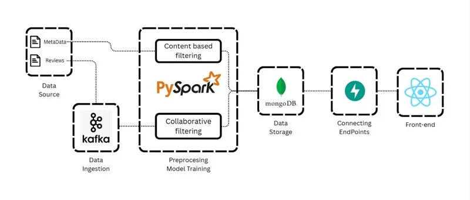

# 🛒 Real-Time E-Commerce Recommendation System (Big Data Project)

## 📌 Overview
This project demonstrates a **real-time product recommendation system** built using **Big Data tools**.  
It combines **Collaborative Filtering, Content-Based Filtering, and Hybrid Methods** to generate recommendations, and integrates **Kafka + PySpark** for streaming simulation.

---

## 🏗️ Architecture

<!--  -->

<p align="center">
    Data flow and components of the real-time recommendation system
    
</p>

---

## 🚀 Features
- Collaborative Filtering using ALS and user segmentation
- Content-Based Filtering using TF-IDF & Cosine Similarity
- Hybrid Recommendations
- Real-time streaming with **Kafka producer** + **PySpark consumer**
- MongoDB for storing product metadata and reviews
- FastAPI backend for serving recommendations
- React frontend

---

## ⚙️ Tech Stack
- **Big Data Tools**: Apache Kafka, Apache Spark (PySpark, MLlib)
- **Databases**: MongoDB
- **Machine Learning**: Scikit-learn, Spark MLlib
- **Backend**: FastAPI
- **Frontend**: React

---

## 📂 Repository Structure

```
als/
 ├── data/             # Sample datasets  
 ├── kafka/            # Kafka producer code  
 ├── spark/            # PySpark consumer code  
 ├── models/           # Saved/pretrained models   
 └── notebooks/        # Colab notebooks (ALS, User Seg ...)
backend/               # FastAPI backend
ecommerce-website/     # Frontend
notebooks/             # Colab notebooks (preprocessing, training, saving)
```